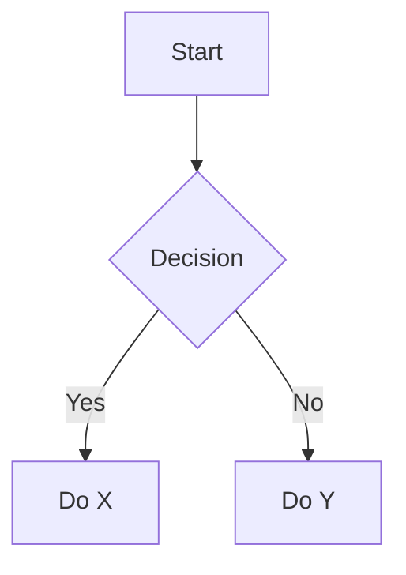

# Sample: Mermaid + Table

Below is a small Mermaid flow and a table to exercise JS diagram rendering + table handling.

| Name   | Role     |
|--------|----------|
| Alice  | Engineer |
| Bob    | Designer |

Image example (image file not included):

