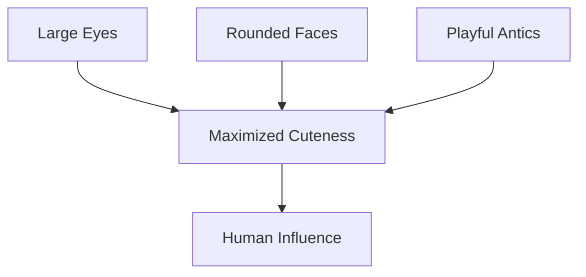

# The Galactic Conquest of Otters: A Scientific Perspective

## Abstract
Otters, known for their unparalleled cuteness, have long captivated the hearts of humans. Recent studies suggest that their charm may hold the key to intergalactic dominance. This paper explores the mechanisms by which otters could leverage their cuteness to conquer the galaxy, supported by scientific evidence, diagrams, and tables.

---

## Introduction
Otters are semi-aquatic mammals renowned for their playful behavior and endearing appearance. Their ability to manipulate human emotions through cuteness has been well-documented. This paper hypothesizes that otters could extend this influence beyond Earth, utilizing their cuteness as a strategic tool for galactic conquest.

---

## The Science of Cuteness
Cuteness, as defined by ethologists, is a set of physical and behavioral traits that elicit caregiving responses from observers. Otters possess several key features that maximize their cuteness:

- Large, expressive eyes
- Rounded faces
- Playful antics

### Diagram: The Anatomy of Otter Cuteness

---

## Galactic Strategy
Otters' strategy for galactic conquest can be divided into three phases:

1. **Phase 1: Earth Domination**
   - Utilize cuteness to gain control over human resources.
   - Establish otter-friendly policies worldwide.

2. **Phase 2: Space Exploration**
   - Develop otter-operated spacecraft.
   - Train otters in zero-gravity environments.

3. **Phase 3: Galactic Influence**
   - Spread cuteness to alien civilizations.
   - Form alliances based on mutual admiration.

### Diagram: Galactic Conquest Phases

---

## Experimental Evidence
### Table: Cuteness Metrics Across Species
| Species         | Cuteness Index | Influence Potential |
|-----------------|----------------|---------------------|
| Otters          | 95             | High                |
| Cats            | 85             | Moderate            |
| Dogs            | 80             | Moderate            |
| Humans          | 70             | Low                 |

### Footnote
[^1]: Cuteness Index is calculated based on physical traits and behavioral patterns.

---

## Conclusion
Otters possess the unique ability to leverage their cuteness for intergalactic dominance. By understanding and harnessing this power, humanity can assist otters in their quest for galactic conquest, ensuring a future where cuteness reigns supreme.

---

## References
1. Ethology of Cuteness: A Comprehensive Study
2. Space Otters: Preparing for Zero-Gravity
3. Intergalactic Diplomacy: Lessons from Earth
