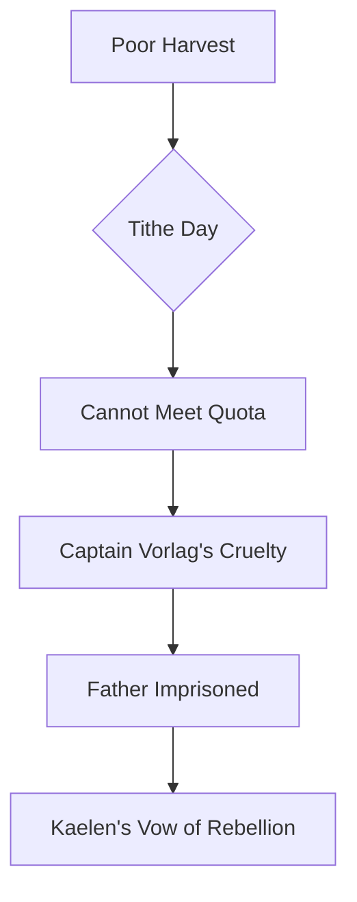
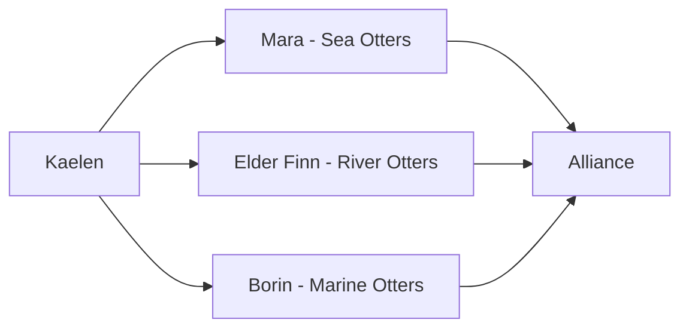
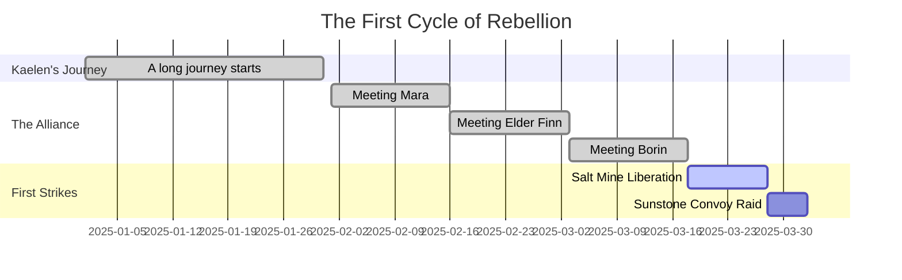
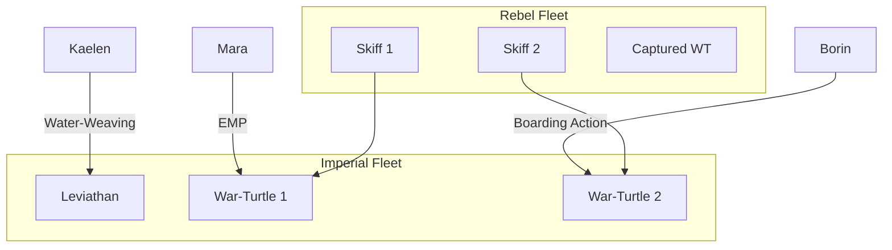
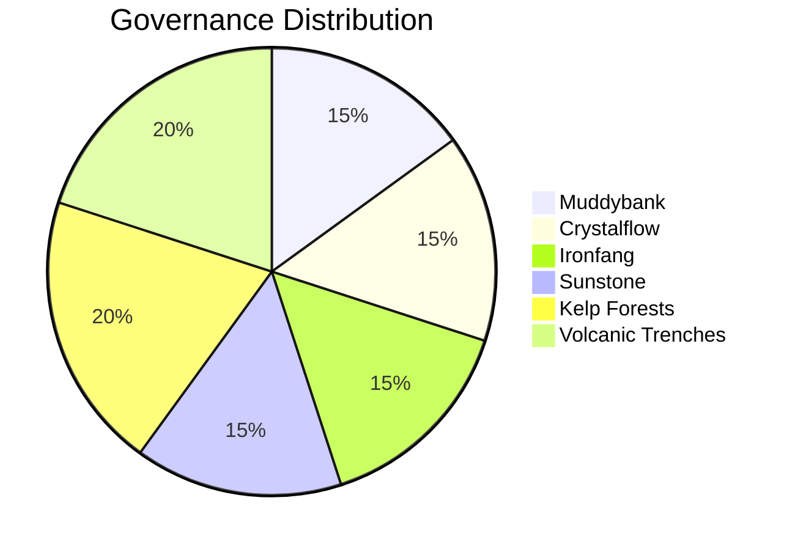

# The Saga of Kaelen, the River Rebel

## Chapter 1: The Gleaming Oppression of the Otter Imperium

In a galaxy far removed from the Milky Way, on the water-rich planet of Lutrania, the Otter Imperium reigned supreme. Under the iron paw of Emperor Lutren the Vast, the society was a rigid hierarchy, where one's birth river determined their destiny. The capital city, Lutra Prime, was a marvel of underwater engineering, powered by geothermal vents and illuminated by bioluminescent algae, a testament to the Imperium's power.

> "From the river you are born, to the river you shall serve. The Emperor's current guides us all."
>
> — Imperial Decree 1.1

The Imperium's structure was clear and unyielding.

| Social Caste      | Role                        | Home River         |
| ----------------- | --------------------------- | ------------------ |
| **Imperial Class**| Rulers and Administrators   | Sunstone River     |
| **Warrior Class** | Soldiers and Enforcers      | Ironfang River     |
| **Artisan Class** | Crafters and Engineers      | Crystalflow River  |
| **Worker Class**  | Farmers and Laborers        | Muddybank River    |

---

## Chapter 2: Kaelen of the Whispering Reeds

Our hero, Kaelen, was born in the remote Muddybank River system, a place of quiet beauty and crushing poverty. His family, like all in their caste, were pearl farmers, diving deep into the murky waters for the iridescent gems that adorned the Emperor's court. Kaelen was different. He possessed a curious mind and a rebellious spirit, often questioning the fairness of the world.

He was known for his exceptional skill in navigating the treacherous underwater caves, a skill he learned from his grandfather, a wise old otter who remembered a time before the Imperium. [^1]

### Kaelen's Skills:
*   **Expert Swimmer:** Capable of holding his breath for over 10 minutes.
*   **Master Navigator:** Knew every secret passage in the Muddybank cave system.
*   **Charismatic Leader:** Possessed a natural ability to inspire others.

---

## Chapter 3: The Spark of Rebellion

The annual Pearl Tithe was a day of dread for the Muddybank otters. Imperial guards would arrive to collect 90% of the harvest. This year, the harvest was poor, and Kaelen's family couldn't meet the quota. The lead guard, a hulking brute named Captain Vorlag, decided to make an example of them. He confiscated their entire harvest and sentenced Kaelen's father to a year of hard labor in the salt mines.

Seeing his father dragged away in chains, something inside Kaelen snapped. That night, he vowed to challenge the Emperor's authority.

---

## Chapter 4: The Gathering of Allies

Kaelen knew he couldn't fight the Imperium alone. He fled his home and began a journey across Lutrania to find others who shared his desire for freedom.

### The Sea Otters of the Kelp Forests

His first stop was the vast Kelp Forests of the western ocean, home to the tech-savvy sea otters. They were masters of disguise and sabotage, using the dense kelp as cover. Their leader, a brilliant engineer named Mara, was initially skeptical of Kaelen's quest.

Kaelen earned her trust by helping her sabotage a major Imperial mining operation that was destroying their habitat.

### The River Otters of the Crystal Mountains

Next, he sought the wise, old river otters of the Crystal Mountains. They were pacifists and keepers of ancient lore. Their leader, Elder Finn, taught Kaelen the history of Lutrania, of a time when all otters were free and equal. He also taught him the art of "water-weaving," a mystical ability to manipulate currents.

### The Marine Otters of the Volcanic Trenches

Finally, he ventured into the dangerous volcanic trenches, home to the fierce and reclusive marine otters. Hardened by the harsh environment, they were formidable warriors. Their chieftain, a scarred veteran named Borin, agreed to join Kaelen after he proved his courage by wrestling a giant abyssal eel.

### The Alliance is Forged

---

## Chapter 5: The Rebellion's Rise

The newly formed "River Rebels" began their campaign against the Imperium.

1.  **Disrupting Supply Lines:** They raided Imperial convoys, stealing food and weapons.
2.  **Liberating Labor Camps:** They freed hundreds of enslaved otters from the salt mines.
3.  **Spreading Dissent:** They used hidden channels to broadcast messages of hope and rebellion across Lutrania.

Their actions did not go unnoticed. Emperor Lutren was furious.

> "Find this 'River Rebel' and bring me his pelt! I will not tolerate this defiance."
>
> — Emperor Lutren

### Timeline of the Rebellion's Early Days

---

## Chapter 6: The Emperor's Wrath

Emperor Lutren amassed his fleet, the most powerful military force on Lutrania, to crush the rebellion. The stage was set for a decisive battle in the Coral Canyons.

### Comparison of Forces

| Force             | The Imperium                               | The River Rebels                           |
| ----------------- | ------------------------------------------ | ------------------------------------------ |
| **Leadership**    | Emperor Lutren, Captain Vorlag             | Kaelen, Mara, Borin                        |
| **Troop Strength**| 10,000 Ironfang Warriors                   | 2,000 assorted warriors                    |
| **Fleet**         | 50 Armored War-Turtles, 1 Leviathan-class Sub | 100 small, fast skiffs, 1 captured War-Turtle |
| **Technology**    | Sonic cannons, laser nets                  | Kelp-based camouflage, EMP charges         |
| **Special**       | ~~Unquestioning Loyalty~~ (wavering)       | **Unbreakable Spirit**                     |

---

## Chapter 7: The Battle of the Coral Canyons

The battle was a maelstrom of chaos and courage. Mara's engineers used their EMP charges to disable the Imperial fleet's navigation systems, causing confusion. Borin's warriors led daring boarding actions. Kaelen, using his water-weaving skills, created massive whirlpools that scattered the enemy formation.

### The Battle Plan

In the heart of the battle, Kaelen confronted Captain Vorlag. Their duel was fierce, but Kaelen's agility and cunning prevailed. He disarmed Vorlag and offered him a choice: join the rebellion or be cast into the abyss. Vorlag, his pride broken, surrendered.

---

## Chapter 8: A New Dawn for Lutrania

The defeat of the Imperial fleet at the Coral Canyons was the turning point. The rebellion swelled as more and more otters rose up against the Emperor. Lutra Prime was besieged, and Emperor Lutren was captured trying to flee with the imperial treasury.

The Imperium was dissolved, and in its place, the Otter Council was formed, with representatives from every river and region.

### The New Otter Council

Kaelen, the reluctant hero, was offered the title of Lord Protector, but he refused.

> "I am no lord. I am Kaelen of the Muddybank River. My place is with my people, ensuring that no otter ever has to bow to another again."

He returned to his home, not as a ruler, but as a farmer, a storyteller, and a guardian of the new freedom they had all won.

---

## Epilogue

Lutrania flourished under the guidance of the Otter Council. The old caste system was abolished, and a new era of cooperation and innovation began. The story of Kaelen, the River Rebel, became a legend, a reminder that even the humblest otter can change the galaxy.

For more information on otter social structures, see [Fictional Otter Studies](https://example.com).

[^1]: The time before the Imperium is known as the "Age of a Thousand Rivers," a period of peace and prosperity.
